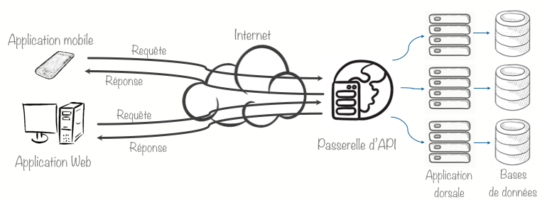

# Lignes directrices des API du gouvernement du Québec (document de travail)

# Table des matières

1. [Préface](#préface)
    1. [Introduction](#introduction)
    1. [Audience](#audience)
    1. [Conventions utilisées dans ce document](#document)
    1. [Contacts](#contact)
    1. [Pourquoi une norme de conception des API?](#norme)
    1. [Comment appliquer cette norme de conception?](#appliquer)
    1. [Pourquoi le style d'architecture REST?](#rest)
    1. [La norme de spécification OpenAPI](#openAPI)
1. [Définitions](#définition)
    1. [API](#API)
    1. [REST](#definitionrest)
    1. [Ressources](#resssources)
    1. [Identifiants de ressource](#idresssources)
    1. [Représentations](#représentation)
    1. [Espace de noms](#namespace)
    1. [Opérations](#opérations)
1. [Exigences gouvernementale des API](#exigences)
    1. [Documentation des API](#documentation)
    1. [Développement des API](#développement)
    1. [L'expérience du développeur](#expérience)
    1. [Stabilité des API](#stabilité)
    1. [Maturité de la conception des API](#maturité)
1. [Sécurité des API](#sécuritéapi)
    1. [Conception des API](#conceptionsecurité)
    1. [Sécurité des transports](#sécuritétransports)
    1. [Authentification et autorisation](#authentificationautorisation)
    1. [Données sensibles dans les requêtes](#donnéessensibles)
    1. [Limitation du débit](#limitationdébit)
    1. [Gestion des erreurs](#gestionerreurs)
    1. [Journaux d'audit](#journauxaudit)
    1. [Validation des entrées](#validationentrées)
    1. [Validation du type de contenu](#validationtypecontenu)
    1. [Utiliser les fonctions de sécurité de la passerelle d'API](#fonctionspasserelle)
    1. [Tests de sécurité](#testssécurité)
    1. [Exigences de sécurité pour les API – OWASP](#owasp)
1. [Conventions de nommage](#nommage)
    1. [Format des messages](#formatmessages)
    1. [Noms des composants URI](#composantesuri)
    1. [Noms des champs](#nomschamps)
    1. [Noms des relations des liens](#nomsliens)
    1. [En-têtes des requêtes](#entetedemandes)
    1. [Gestion des dates](#dates)
    1. [Exemples](#exemples)
1. [Versionnage des API](#versionnage)
    1. [Gestion sémantique des versions](#sémantiqueversion)
    1. [Version majeure](#versionmajeure)
    1. [Version mineure](#versionmineure)
    1. [Rétrocompatibilité](#rétrocompatibilité)
    1. [Politique de fin de vie](#findevie)
    1. [Désuétude des API](#désuétude)
1. [Requête des API et paramètres](#requêteparamètres)
    1. [Entête des requêtes](#entêterequêtes)
    1. [Méthodes des requêtes HTTP](#méthodeshttp)
    1. [Formats du contenu des requêtes (Request Payload Formats)](#formatréponses)
    1. [Idempotence](#idempotence)
    1. [Paramètres de requête](#paramètresrequête)
    1. [Pagination](#paramètresrequête)
    1. [Filtrage et tri](#Filtragetri)
1. [Réponses des API](#réponses)
    1. [Entête des réponses](#entêteréponses)
    1. [Codes de réponse HTTP](#codesréponsehttp)
    1. [Contenu des réponses](#contenuréponses)
1. [Hypermédia (HATEOAS)](#hypermédia)
1. [Outils de test](#outilstest)
1. [Références](#références)

# Préface <a name="préface"></a>

## Introduction <a name="introduction"></a>

Ce document décrit la norme de conception pour l'ensemble des interfaces de programmation d'application (API) du Québec. Ce guide s'adresse à toute personne œuvrant au développement de services numériques pour une fonction publique, que ce soit dans le cadre de la fonction publique du Québec, d'une agence gouvernementale ou autre.

Ce document de normes API est un travail en cours d'élaboration (*work-in-progress*). Pour y contribuer, veuillez faire une demande à l'adresse ci-dessous. L'équipe de gestion des API du gouvernement du Québec analysera la demande et décidera si celle-ci peut être intégrée.

## Audience <a name="audience"></a>

Le public visé par ce document sont les développeurs d'API, les architectes d'entreprise et de solutions et les analystes organiques et d'affaire.

Ce document a été écrit dans le but d'être utilisé au sein du gouvernement du Québec. Il est rendu public afin de permettre une adoption plus large par des particuliers ou des organisations partenaires qui souhaitent aussi publier ou consommer des API interopérables avec les standards du gouvernement du Québec.

## Conventions utilisées dans ce document <a name="document"></a>

Les mots clés **DOIT**, **NE DOIT PAS**, **DEVRAIT**, **NE DEVRAIT PAS**, **RECOMMANDÉ**, **PEUT** et **OPTIONNEL** dans ce document doivent être interprétés tel que décrit dans le standard [RFC 2119](https://www.ietf.org/rfc/rfc2119.txt).

Les acronymes sont écrits en majuscules. Par exemple, les mots REST, JSON, XML et tous les autres acronymes sont tous représentés de cette façon.

La grande majorité de la littérature disponible sur les API REST n'est disponible qu'en anglais seulement. En conséquence, les auteurs de cette norme ont jugé utile d'indiquer en *italique* le terme anglais pour des fins de référence.

Les textes lisibles par traitement informatique (programme, script, etc.) tel que les URL, les verbes HTTP et les codes sources, sont représentés par la `mise en évidence (surbrillance) des blocs de code`.

## Contact <a name="contact"></a>

(ex: equipeapi@api.quebec.ca)

## Pourquoi une norme de conception des API? <a name="norme"></a>

La principale intention de ce document est de servir de référence dans la phase de conception du développement d'un nouvel API.

Les normes de conception définies dans ce document sont indépendantes des données (ne tiennent pas compte du type de données consommées ou produites) et des langages de programmation.

Ces normes de conception présentent des patrons communs de conception qui sont applicables à tous les scénarios d'API. Ces patrons de conceptions sont basés sur des standards reconnus par l'industrie.

## Comment appliquer ce cadre normatif? <a name="appliquer"></a>

Il est important de bien comprendre quand et comment appliquer ces normes de conception d'API. En effet, la catégorie à laquelle appartient l'API déterminera si vous devrez ou non utiliser ce cadre normatif.

Une API appartiendra généralement à l'une des catégories suivantes:

- **API de niveau système (application)**: il s'agit d'API de bas niveau exposées directement par une application.

- **API de niveau composition/orchestration**: il s'agit d'API composées d'autres API systèmes soit via une orchestration et/ou une chorégraphie.

- **API de niveau d'intégration/externe**: il s'agit d'API destinées à faciliter l'adoption de l'intégration d'API entre une organisation et ses consommateurs externes.

Si l'API fait partie du niveau système (application) et est développée sur mesure (maison), il est **RECOMMANDÉ** d'utiliser cette norme de conception car elle facilitera le développement futur des API de niveau processus ou d'intégration.

Si l'API est de niveau de processus, il est aussi fortement **RECOMMANDÉ** d'appliquer cette norme de conception. En effet, les API de niveau de processus sont souvent réutilisées par différents consommateurs.

Si l'API est de niveau d'intégration, ces normes de conception **DOIVENT** être appliquées.

## Pourquoi le style d'architecture REST? <a name="rest"></a>

Cette norme de conception des API du gouvernement du Québec est basée sur le style d'architecture REST (Representational State Transfer).

Bien qu'il existe d'autres modèles de conception pour les API (par exemple, SOAP, GraphQL et gRPC), la grande majorité des développeurs de l'industrie des TI ont largement adopté REST comme mécanisme de représentation et de transfert de données entre les différentes applications visibles sur Internet. Les gouvernements de l'Ontario, du Canada, du Royaume-Uni, de l'Australie et de nombreux autres ont déjà adoptés le style d'architecture REST. Ce standard a aussi été adopté par la grande majorité des fournisseurs de services infonuagiques (Azure, AWS, Google Cloud, DigitalOcean, etc.).

L’adoption massive du style d’architecture REST réside dans son efficacité à modéliser des systèmes et des données plus rapidement tout en facilitant le partage de celles-ci. Les principes REST peuvent être appliqués aux systèmes de petite et de grande envergure. La plupart des outils disponibles pour le développement de solution supportent également facilement les accès aux données via les principes REST.

En tenant compte de ces tendances fortes du marché autant en Amérique du Nord qu’ailleurs dans le monde, il a été déterminé que le style d’architecture REST serait la base de la modélisation des API dans le gouvernement du Québec.

**Limites des API REST au Gouvernement du Québec**

Il est important de prendre note que les API REST ne sont généralement pas adaptées à la diffusion (streaming) de données ou dans les cas où la performance des interaction est essentielle. GraphQL et gRPC/JSON-RPC sont des alternatives en émergence qui seront éventuellement considérées comme des options pour les standards du gouvernement du Québec. Un aiguilleur sera disponible bientôt afin d'aider les concepteurs dans le choix de l'architecture à considérer.

Finalement, étant donné que les outils pour les API REST sont largement disponibles et que les développeurs sont déjà familier avec ceux-ci (autant en Amérique du Nord qu'ailleurs dans le monde), il a été déterminé que le style d'architecture REST serait la base de la modélisation des API dans le gouvernement du Québec.

## La norme de spécification OpenAPI <a name="openAPI"></a>

La spécification OpenAPI (anciennement la spécification Swagger) est une spécification ouverte pilotée par la communauté de l'[OpenAPI Initiative](https://www.openapis.org/), un projet collaboratif de la Linux Foundation.

La spécification [OpenAPI](https://www.openapis.org/) est un format de description d'API pour les API REST. Un fichier OpenAPI permet de décrire toutes les caractéristiques d'un API, incluant :

- Points de terminaison disponibles (*endpoints*) (ex `/utilisateurs`) et opérations sur chaque point de terminaison (*endpoints*) (ex `GET /utilisateurs`, `POST /utilisateurs`)
- Paramètres des opérations
- Méthodes d'authentification
- Coordonnées, licence, conditions d'utilisation et autres informations.

Les spécifications d'API peuvent être écrites en YAML ou JSON. Le format est facile à apprendre et lisible autant par les humains que par les machines. La spécification OpenAPI complète peut être trouvée sur GitHub: [Spécification OpenAPI](https://github.com/OAI/OpenAPI-Specification).


# Définitions <a name="définition"></a>

## API <a name="API"></a>
En informatique, une interface de programmation d’application (en anglais API pour *Application Programming Interface*) est un ensemble normalisé de classes, de méthodes, de fonctions et de constantes qui sert de façade par laquelle une application offre des services à d'autres applications. Elle est offerte par une bibliothèque logicielle ou un service web, le plus souvent accompagnée d'une description qui spécifie comment des programmes consommateurs peuvent se servir des fonctionnalités du programme fournisseur.

Dans le contexte de cette norme de conception d'API, une API est définie comme un service Web. Elle est utilisée pour créer des applications distribuées, dont les composants sont faiblement couplés.


## REST <a name="definitionrest"></a>
REST (*REpresentational State Transfer*) est un style d'architecture logicielle définissant un ensemble de contraintes à utiliser pour créer des services web.

Les services web conformes au style d'architecture REST, aussi appelés services web RESTful, établissent une interopérabilité entre les ordinateurs sur Internet.

Les services web REST permettent aux systèmes effectuant des requêtes de manipuler des ressources web via leurs représentations textuelles à travers un ensemble d'opérations uniformes et prédéfinies sans état.

Essentiellement, ce style d’architecture vise à utiliser tous les standards du Web afin de développer des applications distribuées. Il a été développé par Roy Thomas Fielding dans sa thèse de [doctorat](https://www.ics.uci.edu/~fielding/pubs/dissertation/top.htm) (Université de Californie, 2000).

Les principaux bénéfices de l’architecture REST est d’exploiter les caractéristiques du Web et de son principale protocole (HTTP) sont :
- Réutilisation des verbes d’actions standards pour interagir avec des stockages persistants (GET pour lire, POST pour créer une nouvelle ressource, PUT pour mettre à jour, DELETE pour effacer, ETC.)
- Réutilisation des mécanismes de cache (fureteur, proxy, passerelle, serveur Web, etc.)
- Réutilisation des mécanismes de redirection et de transfert
- Réutilisation des mécanismes de sécurité (cryptage, authentification, etc.)

Toutes ces caractéristiques sont des facteurs essentiels afin de créer des services résilients. Un autre avantage important réside dans le fait que le Web est construit à partir de multitude de spécifications succinctes permettant une évolution plus facile et éviter ainsi d’interminables polémiques sur la sélection des normes.

## Ressources <a name="resssources"></a>

Afin de concevoir une API facilement utilisable, les applications doit être divisées en groupes logiques, aussi appelés des ressources.

Par exemple, dans un système de gestion de ressources humaines (RH), les ressources sont les `employés`, les `postes` et les `demandes de congés`.

La décomposition des systèmes en ressources permet une séparation des préoccupations (*"separation of concerns"*). Par exemple, seul un employé peut faire une demande de congés. Cela garantit également que chaque élément de données retourné par l'API sera minimaliste afin répondre aux exigences du client.

Les ressources sont similaires aux objets dans le paradigme de programmation orientée objet (POO). Généralement, les ressources sont les «noms» que nous retrouvons dans une application. Il y a cependant une différence importante entre REST et POO: les méthodes de REST sont limitées à l'ensemble des méthodes HTTP (GET, PUT, POST, etc.), alors qu'en POO les méthodes peuvent être arbitraires. Outre les méthodes HTTP spécifiées dans l'interface de ressource uniforme (*uniform resource interface*), aucune autre méthode ne peut être utilisée pour manipuler une ressource, c'est à dire qu'aucune autre méthode ne peut être indiquée dans les requêtes des API, ni dans le corps HTTP, ni dans le chemin de base ou dans les paramètres.

## Identifiants de ressource <a name="idresssources"></a>

Toutes les ressources disponibles dans un système (par exemple, chaque `employé` ou chaque `demande de congé`) doit être identifiable de manière unique. Ceci est un élément clé d'un API RESTful, soit la possibilité d'adresser individuellement tout élément d'un système.

Voici quelques exemples d'identificateurs de ressources :
| Nom                       | Exemple                                         |
| ------------------------- |-------------------------------------------------|
| Numérique                 | /employes/123456                                |
| Chaîne de caractères      | /employes/marie-tremblay                        |
| Date                      | /dates/2020-10-23                               |
| GUID                      | dceb9c63-a73b-44c9-9a48-93813d37fee7            |

**Note** : Lorsque des identifiants numériques sont utilisés, ils **NE DOIVENT PAS** être séquentiels afin d'éviter une facilité à deviner le prochain identificateur.

## Représentations <a name="représentation"></a>
Un concept clé dans la conception d'API RESTful réside dans l'idée de représenter une ressource à un moment donné dans le temps.

Dans notre exemple d'un système de gestion de ressources humaines, lorsque qu'une application cliente demande une informations sur un employé, le système de RH retournera cette représentation :

```
HTTP 1.1 GET /employees/123456
Accept: application/json

200 OK
Content-Type: application/json

{
  "nom" : "Marie Tremblay",
  "no_employe" : "123456",
  "poste" : "Directrice",
  "en_conge" : false
}
```
L'état de cette représentation peut changer dans le temps. Un appel ultérieur à ce même *"endpoint"* peut potentiellement produire une représentation différente si l'employée est en congé ou si son poste au sein de l'organisation a changé.

Il est également possible de demander une représentation entièrement différente de cette même ressource (si le système le permet). Par exemple, une version PDF de cette employée peut être produite via une instruction spécifique dans l'entête `Accept`. L'exemple ci-dessous retournera une version PDF de la requête :

```
HTTP 1.1 GET /employes/123456
Accept: application/pdf

200 OK
Content-Type: application/pdf

...<CODE BINAIRE>...
```
## Espace de noms (*namespace*) <a name="namespace"></a>
L'espace de noms (*namespace*) d'un service définit le regroupement d'un ensemble de fonctions associées. Les espaces de noms (*namespace*) peuvent être de niveau élevé (par exemple, le nom d'un OP ou d'un service) ou bas (par exemple un projet spécifique ou une équipe précise).

Les espaces de noms (*namespace*) sont utiles pour fournir aux consommateurs d'API des accès à des regroupements via une passerelle d'API. Une fois qu'un consommateur a un jeton d'accès (*access token*) à un espace de noms particulier, il peut alors avoir accès à toutes les fonctions fournies dans cet espace de noms (*namespace*).

Les espaces de noms (*namespace*) doivent être tenus en compte dans la conception de la structure d'un URL (voir la section Noms des composants URI).

## Opérations <a name="opérations"></a>

Les développeurs utilisent des Operations afin d'accéder aux espaces de noms (*namespace*), ressources et des identificateurs de ressources.

Une opération est définie par l'utilisation d'une méthode HTTP et d'un chemin de ressource.

Exemples:
```
GET /employes
GET /employes/123456
DELETE /employes/123456
```

# Exigences gouvernementale des API <a name="exigences"></a>

## Documentation des API <a name="documentation"></a>

Une bonne documentation d'un API est un élément essentiel. En effet, cela facilite l'interopérabilité des services grâce à un document descriptif commun. Idéalement, la structure, les méthodes, les conventions de dénomination (*naming conventions*) et les réponses seront normalisées afin de garantir une expérience commune aux développeurs qui accèdent aux services provenant des différents OP ou agence.

En conséquence, toutes les API créées pour le gouvernement québécois **DOIVENT** fournir un document OpenAPI v2.0. Un document OpenAPI v3.0 **PEUT** également être fourni pour assurer la pérennité de l'API.

Il est **RECOMMANDÉ** d'inclure les sections suivantes dans le document de description de l'API :

- À propos de
- Mentions légales
    - Conditions d'utilisation
    - Licence
    - Classification des données
    - Droits d'auteur
- Exigences d'authentification
- Modèle de données
- Nous contacter

## Développement des API <a name="développement"></a>
Il est **RECOMMANDÉ** de suivre les directives suivantes lors du développement d'une API:

- Le document de description de l'API **DEVRAIENT** contenir une description de haut niveau et **DEVRAIENT** être versionnés.

- Ils **DOIVENT** être considérés comme des contrats techniques entre les concepteurs (*designers*) et les développeurs et entre consommateurs et fournisseurs.

- Les API simulées (*mock*) **DEVRAIENT** être créées en utilisant la description de l'API afin de permettre aux consommateurs de s'intégrer rapidement dans la phase de réalisation et retrouner un exemple de réponse.

- Le comportement et les réponses de l'API **DEVRAIENT** être décrits avec autant d'informations que possible dans la documentation de l'API.

- La documentation **DEVRAIT** être facilement accessible aux consommateurs.

- Les descriptions **DEVRAIENT** contenir au moins un exemple de requête et de réponses.

- Des exemples de corps (*bodies*) de requêtes et de réponses **DEVRAIENT** être fournis en totalité.

- Les codes de réponse et les messages d'erreur attendus **DEVRAIENT** être fournis en totalité.

- Des codes de réponse HTTP précis **DEVRAIENT** être utilisés.

- Les problèmes connus ou les limitations (*known issues or limitations*) **DEVRAIENT** être clairement documentés.

- Les performances attendues, la disponibilité et le niveau de service (*SLA*) des API **DEVRAIENT** être documentés.

- La chronologie dans laquelle les méthodes seront obsolètes **DEVRAIT** être fournie. (Voir la section Politique de fin de vie et dépréciation de l'API).

- Toute la documentation de l'API **DEVRAIT** être imprimable ou exportable.

Tous les documents OpenAPI **DEVRAIENT** être fournis au format JSON.

Afin de suivre les recommandations de versionnage de cette norme, il **DOIT** y avoir une description OpenAPI par version principale. Par exemple; si votre produit API expose et gère 3 versions principales de son API REST, vous devez fournir 3 descriptions OpenAPI (une pour chaque version, soit v1, v2 et v3).

## L'expérience du développeur <a name="expérience"></a>

Une API difficile à utiliser réduit sa probabilité d'utilisation de la part des consommateurs. Il est également peu probable que ceux-ci la recommandent à d'autres consommateurs d'API.

Il est fortement **RECOMMANDÉ** que les API en cours de conception soient testées avec de véritables consommateurs. Toutes rétroactions données **DEVRAIENT** être pris en compte afin d'être intégré à l'API.

L'équipe API du gouvernement du Québec fournit un processus d'examen des API afin de garantir que les API répondent à un niveau minimaliste d'utilisabilité avant qu'elles ne soient publiées aux consommateurs.


## Stabilité des API <a name="stabilité"></a>

Les API **DOIVENT** être conçues en gardant à l'esprit la rétro-compatibilité lorsque des modifications sont apportées.

L'introduction de nouveaux champs dans une API ou l'ajout de nouveaux points de terminaison (*endpoints*) représente un changement sans rupture.

Si le contrat API doit changer d'une manière qui rompt celui-ci avec ses des consommateurs, cela **DEVRAIT** être communiqué clairement.

1. Les propriétaires de des API **DEVRAIENT** documenter la durée de vie du support de ceux-ci.
1. Les nouvelles fonctionnalités **DOIVENT** être introduites de manière à ne pas affecter les consommateurs existants.
1. Toutes les activités de dépréciation (*deprecation*) **DOIVENT** être connues des consommateurs avant leur mise en œuvre.

## Maturité de la conception des API <a name="maturité"></a>

Lors de la conception d'une nouvelle API, l'une des principales considérations est l'expérience du développeur qui utilisera celle-ci.

Afin d'aider les concepteurs d'API peuvent se référer au [modèle de maturité de Leonard Richardson (2008)](https://martinfowler.com/articles/richardsonMaturityModel.html) afin de s'assurer que leurs API sont conforme au style REST.


Le modèle de maturité proposé par Richardson classe les API en fonction de leur adhésion et de leur conformité aux principes REST selon quatre niveaux (de 0 à 3).

- Niveau 0 - État de base pour toute nouvelle API. Le niveau 0 utilise un simple URI (typiquement des POST) et HTTP comme système de transport pour les interactions entre les applications, mais sans utiliser aucun autres des mécanismes du Web. Il s’agit essentiellement d’échanger des fichiers XML (« Plain Old XML » – POX). Bien que ce style d’architecture soit populaire (simplicité d’implémentation), il n’utilise pas les caractéristiques du Web, soit sa capacité de monter en charge (*scalability*), fiabilité et sa robustesse. De plus, celui-ci amène un problème de couplage fort entre les applications. Cette approche est fortement déconseillée.
- Niveau 1 - L'API implémente différents URI, mais un seul verbe (par exemple POST). Le niveau 1 introduit des « ressources » et permet de faire des requêtes à des URI individuels (généralement en utilisant des POST) pour des actions distinctes au lieu d'exposer un point de terminaison universel (de service unique). Une ressource représente une entité unique ou une collection de tout ce qu’on peut exposer sur le Web (ex. un document, une vidéo, une fiche client, une commande, etc.).
- Niveau 2 - L'API implémente différents URI et plusieurs verbes (par exemple CRUD via GET / POST / PUT / DELETE). Le niveau 2 utilise les verbes HTTP, soit GET (obtenir des données), POST (pour créer de nouvelles données), DELETE (pour effacer des données), PUT (mettre à jour des données), etc. Cette technique permet de spécialiser davantage la ressource et d'affiner ainsi la fonctionnalité de chaque opération individuelle avec le service. Ce niveau est celui utilisé par la majorité des fournisseurs infonuagique (ex S3 d’AWS) et il permet d’accéder aux niveau 3.
- Niveau 3 - L'API implémente différents URI, plusieurs verbes et HATEOAS (« Hypermedia As The Engine of Application State ») pour représenter les relations entre les objets. Essentiellement, il s’agit d’ajouter les actions permises dans les messages de réponse. Ces actions peuvent être déterminer selon le cas d’utilisation et/ou le niveau d’autorisation du consommateur et représentent l’état de la ressource. C’est ce niveau de maturité qui permet le couplage le plus faible entre les applications.

Toutes les API adhérant à cette norme **DOIVENT** être conçues au niveau 2 du modèle de maturité Richardson.

Il est **RECOMMANDÉ** de mettre en œuvre le niveau 3 du modèle, mais ce n'est pas obligatoire pour cette norme.

# Sécurité des API <a name="sécuritéAPI"></a>

## Conception des API <a name="conceptionsecurité"></a>

Les orientations liées à la sécurité visent à assurer la protection de l’ensemble des actifs informationnels à l’égard de la disponibilité, de l’intégrité, de la confidentialité, de l’authentification et de traçabilité et non-répudiation.

Il est important de prendre note que le niveau de sensibilité des différents API est identique à celui déterminé suite à l’analyse de la sensibilité de la solution même et ses données.

Afin d’assurer une uniformité et établir de bases solides et sécuritaires dans le développement des API pour l'ensemble du gouvernement du Québec, les normes de sécurité obligatoire (identifiées par **DOIVENT**) du présent cadre doivent être respectées.

## Sécurité des transports <a name="sécuritétransports"></a>

- Tous les transports **DOIVENT** utiliser HTTPS (TLS 1.2 ou plus récent).
- Tous les certificats **DOIVENT** utiliser l'algorithme de hachage sécurisé SHA256 avec une longueur de clé minimale de 2,048.
- Tous les points de terminaison accessibles (*endpoints*) au public **DOIVENT** utiliser un certificat numérique (*Digital Certificate*) signé par une autorité de certification approuvée.
- Les points de terminaison (*internal facing endpoints*) internes **PEUVENT** utiliser des certificats numériques auto-signés (*self-signed Digital Certificates*).
- Les redirections du trafic HTTP vers HTTPS **DOIVENT** être rejetées.
- Les méthodes HTTP inutilisées **DEVRAIENT** être désactivées et retourner un code de status HTTP `405 Not Allowed`.
- Toutes les requêtes **DOIVENT** être validées.

## Authentification et autorisation <a name="authentificationautorisation"></a>

- L'authentification de base ou Digest **NE DOIT PAS** être utilisée.
- L'en-tête `Authorization: Bearer` **DOIT** être utilisé pour l'authentification/l'autorisation.
- La norme JSON Web Tokens ou JWT **DOIT** être utilisée afin de représenter les réclamations (*claims*) en toute sécurité entre les applications clientes et back-end.  JWT est une spécification ouverte définit dans le standard [RFC 7519](https://tools.ietf.org/html/rfc7519).
- Il est **RECOMMANDÉ** de donner une date d'expiration raisonnable pour les jetons. La durée de vie du jeton JWT **NE DEVRAIT PAS** dépasser 5 minutes.
- Les entêtes CORS (*Cross-Origin Resource Sharing*) **NE DEVRAIENT PAS** être utilisés, sauf si cela est absolument nécessaire. En effet, ceux-ci, réduisent les mécanismes de sécurité intégrés aux navigateurs Web en assouplissant ces restrictions.
- OAuth 2.0 **DOIT** être utilisé pour gérer les autorisations.
- OpenID Connect **PEUT** être utilisé pour recevoir des informations sur les utilisateurs authentifiés (exemple : nom d'utilisateur, téléphone, etc.).
- **L'équipe d'API du gouvernement du Québec fournira un service OAuth pour cette fin.**

## Données sensibles dans les requêtes <a name="donnéessensibles"></a>

Les données sensibles **NE DEVRAIENT PAS** apparaitre dans l'URL des requêtes, ni dans les réponses sans que celles-ci soient encryptées. En effet, les chaînes de requête des URL peuvent être compromises et ce, même avec un chiffrement du transport (TLS). Si une requête comporte des éléments de données sensibles (par exemple, un numéro d’assurance sociale), il est fortement **RECOMMANDÉ** d'utiliser les paramètres de requête dans un message JSON plutôt que dans la chaîne de requête URL.

## Limitation du débit <a name="limitationdébit"></a>

Il est fortement **RECOMMANDÉ** de mettre des quotas quant à la fréquence d'appels des API et de suivre son utilisation dans un historique. Une augmentation du nombre d'appels peut indiquer que l'API est utilisée de manière abusive. Il peut également s'agir d'une erreur de programmation(par exemple, une boucle infinie qui ne cesse d'appeler l'API). Il est aussi fortement **RECOMMANDÉ** d'établir des règles de limitation des requêtes (*rate limiting*) pour protéger les API des pics de trafic et des attaques par déni de service (*Denial of Service - DoS*). Des alertes appropriées seront fournis afin de répondre aux consommateurs lorsque les seuils ont été dépassés.

Les entêtes suivants peuvent être retournés lorsque les seuils ont été dépassés :

| En-tête                  | Description                                                                                 |
| ------------------------ | ------------------------------------------------------------------------------------------- |
| `X-Rate-Limit-Limit`     | Plafond de la limite de débit atteinte (par exemple, 100 messages).                         |
| `X-Rate-Limit-Remaining` | Nombre de demandes restantes pour la fenêtre de temps (par exemple, 45 messages).           |
| `X-Rate-Limit-Reset`     | La fenêtre de temps restante (en secondes) avant la réinitialisation de la limite de débit. |

## Gestion des erreurs <a name="gestionerreurs"></a>

Lorsque qu'une application affiche des messages d'erreur, elle **NE DOIT PAS** exposer des informations pouvant être exploitées pour des fins d'attaque. Les contrôles doivent être appliqués dans les messages d'erreur :
- Les réponses des API **DOIVENT** masquer toutes les erreurs liées au système dans les réponses d'état HTTP et les messages d'erreur. Par exemple, les réponses ne devraient pas exposer des informations du niveau du système (*system level*).
- Les réponses des API **NE DOIVENT PAS** transmettre de détails techniques (par exemple, des *call stacks* ou autres informations internes) au client.

## Journaux d'audit <a name="journauxaudit"></a>

Il est **RECOMMANDÉ** de définir le bon niveau de journalisation et d'audit et de définir les bonnes alertes.

Il est **RECOMMANDÉ** d'enregistrer et surveiller les performances et les activités des API afin de suivre l’utilisation et surveiller les activités suspectes, y compris les accès anormaux, tels que les demandes en dehors des heures d’ouverture, les demandes de données importantes et autres. Utilisez des normes d’enregistrement dans les journaux et intégrez les journaux de manière centralisée.

## Validation des entrées <a name="validationentrées"></a>

Afin d'éviter des attaques malveillantes, il est fortement **RECOMMANDÉ** de la valider les requêtes et permet de garantir que seules les données valides seront traitées.

Par exemple :
- Définir une limite appropriée de la taille des demandes et rejeter les demandes dépassant cette limite.
- Valider l'entrée: par ex. longueur minimale et maximale des chaînes de caractères, format (des dates, adresse courriel, etc.)
- Journaliser les échecs de validation d'entrée.


## Validation du type de contenu <a name="validationtypecontenu"></a>

Rejeter les demandes contenant des entêtes de type de contenu (*content type headers*) inadéquats ou manquants avec un statut de réponse HTTP `415 Unsupported Media Type`.

## Utiliser les fonctions de sécurité de la passerelle d'API <a name="fonctionspasserelle"></a>

Il est fortement **RECOMMANDÉ** d'utiliser les fonctionnalités de sécurité disponibles dans la passerelle d'API du gouvernement du Québec que de mettre en œuvre des politiques dans les API eux-mêmes. **à compléter lorsque la passerelle sera sélectionnée.**

## Tests de sécurité <a name="testssécurité"></a>

Il est fortement **RECOMMANDÉ** d'intégrer des tests de sécurité dans les API.

## Exigences de sécurité pour les API – OWASP <a name="owasp"></a>

Ci-dessous se trouvent les exigences de sécurité permettant de mieux sécuriser les API et les données :
- S’assurer que les communications entre les différents composants de l'application, y compris les API et les couches de données, sont authentifiées. Les composants doivent respecter le principe « Du droit d’accès minimal ».
- S’assurer que toutes les voies d'authentification et toutes les API de gestion d'identité mettent en œuvre une force de contrôle de sécurité d'authentification cohérente, de sorte qu'il n'y ait pas des alternatives plus faibles par rapport au risque de l’application.
- S’assurer que les clés des API sont gérées de manière sécurisée et elles ne sont pas inclus dans le code source ou stockés dans les dépôts de code source.
- S’assurer que les API n’utilisent pas des clés statiques.
- S’assurer que les API sont protégées contre les attaques directes d'objets ciblant la création, la lecture, la mise à jour et la suppression d'enregistrements, notamment la mise à jour des enregistrements de quelqu’un d’autre ou la suppression de tous les enregistrements.
- S’assurer que les URL des API sont protégées contre l'attaque *Path Traversal* ou *Directory traversal*.
- S’assurer que les URL des API n'exposent pas des informations sensibles.

Ci-dessous vous trouverez des exigences permettant de mieux sécuriser les API RESTful :
- S’assurer que les méthodes HTTP RESTful activées sont un choix valide pour l'utilisateur ou une action, par exemple : empêcher les utilisateurs normaux d'utiliser DELETE ou PUT sur une API.
- S’assurer que la validation du schéma JSON est en place et elle est vérifiée avant d'accepter une entrée.
- S’assurer que les services Web RESTful qui utilisent des cookies sont protégés contre la falsification de requête *CrossSite* via l'utilisation d'au moins un ou plusieurs des éléments suivants: modèle de cookie à triple ou double soumission, nombres aléatoires d’une seule utilisation ou vérifications de l'entête de requête *ORIGIN*.
- S’assurer que les services REST disposent de contrôles anti-automatisation pour se protéger contre les appels excessifs, notamment si l'API n'est pas authentifiée.
- S’assurer que les services REST vérifient explicitement que le *Content-Type* entrant est celui attendu, tel que : application/XML ou application/JSON.
- Vérifier que les entêtes de message et la charge utile sont fiables et non modifiés en transit. Exiger un cryptage fort pour le transport(TLS uniquement) dans de nombreux cas peut être suffisant, car il assure à la fois la protection de la confidentialité et de l'intégrité.

# Conventions de nommage (*Naming Conventions*) <a name="nommage"></a>

## Format des messages <a name="formatmessages"></a>

Pour les noms de corps de requête et de réponse (*request and response body*) et des paramètres des requêtes, Il est **RECOMMANDÉ** d'utiliser le format de message  *snake-case* :

Exemple:
```
// ceci_est_un_snake_case

{
  "employe_id" : "123456"
}
```
S'il n'est pas possible d'utiliser le *snake-case* , le format *camel case* est alors **RECOMMANDÉ** .

Exemple:
```
// ceciEstUnCamelCase

{
  "employeId" : "123456"
}
```

## Noms des composants URI <a name="composantesuri"></a>

Les URI de cette norme suivent la spécification [RFC 3986](https://tools.ietf.org/html/rfc3986) afin de simplifier le développement et la consommation de services d'API REST.

**Composants de l'URI**

La structure des URL utilisées dans les API **DEVRAIT** être significative pour les consommateurs. Les URL **DEVRAIENT** suivre une structure hiérarchique prévisible afin d'assurer sa compréhension et sa convivialité.

Les URL **DOIVENT** suivre la convention de dénomination standard tel que décrite ci-dessous:
```
https://API.quebec.ca/namespace/v1/collection?attributes=prenom,nom
\___/   \___________/\______________________/\____________________/
  |           |                   |                     |
schéma     autorité            chemin                requête
```
**Longueur maximale de l'URI**

L'URI total, y compris le chemin et la requête, **NE DOIT PAS** dépasser 2000 caractères, incluant les codes de mise en forme tels que les virgules, les traits de soulignement, les points d'interrogation, les tirets, les barres obliques, etc.

**Conventions de dénomination des URI**

Les URL **DOIVENT** suivre la convention de dénomination standard décrite ci-dessous:

- l'URI DOIT être spécifié en minuscules
- seuls les tirets «-» peuvent être utilisés pour séparer les mots ou les paramètres pour des fins de lisibilité (pas d'espaces ni de traits de soulignement)
- seuls les traits de soulignement peuvent être utilisés pour séparer les mots dans les noms de paramètres de requête, mais pas dans le cadre de l'URI de base.

Le tableau suivant explique comment construire l'URI de l'API.

| Élément de l'URI                        | Description                                                  | Exemple                                                      |
| --------------------------------------- | ------------------------------------------------------------ | ------------------------------------------------------------ |
| Protocol                                | Toutes les API **DOIVENT** être exposées en utilisant HTTPS. | `https://`                                                   |
| Autorité > Environment                  | Le domaine dans lequel le point de terminaison (*endpoint*) de l'API sera exposé.| `api.quebec.ca`                                              |
| Chemin > API                            | Le nom d'API dérivé du domaine métier.                       | Exemple : `/namespace/nom-du-projet`. |
| Chemin > Version                        | La version de l'API à laquelle le consommateur souhaite accéder. | Exemple : `/v1`. |
| Chemin > Collection                     | La collection identifie une liste de ressources. La collection **DOIT** être nommée en utilisant la représentation plurielle d'un nom. |  |
| Chemin > Resource                       | L'identifiant de ressource qui correspond à une instance de la ressource. | Par exemple, l'API nom-du-projet, un employé spécifique avec l'ID 123456 serait récupérés en utilisant `GET` `/project-name/v1/employes/E13454` |
| Chaîne de requête> Paramètres/Filtres   | Les paramètres de requête **NE DOIVENT PAS** être utilisés pour transporter des données réelles. Les paramètres de requête suivants **DEVRAIENT** être pris en charge par votre API là où ils seraient utiles: **attributs** - spécifiez ou restreignez les attributs à renvoyer **filtres** - conditions pour restreindre / filtrer la liste de collection **sort** - spécifiez l'exigence de tri **page** - spécifiez l'index de pagination à renvoyer dans un ensemble de collections | Par exemple, `attributes=prenom,nom` retourne un élément de données ne contenant que `prenom` et `nom` attributes`filters=date_de_creation => 2001-09-20T13:00:00 et date_de_creation <= 2001-09-21T13:00:00 et prenom like 'Marie' et post_code=3000` - retourne une collection de ressources avec une date de création entre 2001-09-20 1pm et 2001-09-21 1pm et prénom 'fred' et post_code est 3000. |

**Noms des ressources**

Les concepteurs d'API **DOIVENT** suivre ces principes lors de la création d'une API REST:

- Les noms **DOIVENT** être utilisés et non des verbes dans l'URI.
- Les noms de ressources **DOIVENT** être au pluriel.
- Les noms de ressources **DOIVENT** être en minuscules et n'utiliser que des caractères alphabétiques et des traits d'union (-).
- Le caractère trait d'union (-) **DOIT** être utilisé comme séparateur de mot dans les paramètres de chemin des URI.

Notez que c'est le seul endroit où les tirets sont utilisés comme séparateur de mots. Dans presque toutes les autres situations, le caractère de soulignement **DOIT** être utilisé.

Bons exemples:
```
/employes
/clients
/produits
```
Mauvais exemples :
```
/obtenir-employe
/client
/ajouter-produit
```
**Noms des paramètres de requête**

- Les expressions dans les chaînes de requête **DEVRAIENT** être séparés en utilisant un trait de soulignement.
- Les valeurs des paramètres de requête **DOIVENT** être codées en pourcentage.
- Les paramètres de requête **DOIVENT** commencer par une lettre et **DEVRAIENT** tous être en minuscules. Seuls les caractères alphabétiques, les chiffres et le caractère de soulignement **DOIVENT** être utilisés.
- Les paramètres de requête **DEVRAIENT** être facultatifs.
- Les paramètres de requête **NE DEVRAIENT** pas contenir de caractères non-sécure.


## Noms des champs <a name="nomschamps"></a>

Le modèle de données pour la représentation **DOIT** être conforme à la spécification `JSON`.

Les valeurs peuvent être des objets, des chaînes, des nombres, des booléens ou des tableaux d'objets.

- Les noms de clé DOIVENT être des mots en minuscules, séparés par un caractère de soulignement.
   - `foo`
   - `bar_baz`
- Un préfixe tel que `is_` ou `has_` **NE DEVRAIT PAS** être utilisé pour les clés de type booléen.
- Les champs qui représentent des tableaux **DEVRAIENT** être nommés en utilisant des noms au pluriel (par exemple, `produits` contient un ou plusieurs produits).

## Noms des relations des liens <a name="nomsliens"></a>

Afin de faciliter la navigation des utilisateurs dans l'API, des liens relationnels **DOIVENT** être fournis.

Un tableau `_links` **DEVRAIT** être fourni pour les ressources. Il contient des objets lien (*link*) qui peuvent référer à des ressources associées dans le système.

Une relation de lien (*link relation*) **DOIT** contenir les éléments suivants:

- href - chaîne contenant l'URL absolue ou relative de la ressource
- rel - la chaîne textuelle décrivant ce qu'est l'entité
- méthode - la méthode HTTP utilisée lors de l'utilisation de la ressource associée.

Exemple:
```
"_links": [
    {
        "href": "/v1/clients/reference-partenaire/ABC-123456",
        "rel": "_self",
        "method": "GET"
    }
]
```

## En-têtes des requêtes <a name="entetedemandes"></a>

Les en-têtes suivants **DEVRAIENT** être utilisés par défaut sur toutes les requêtes.

| En-tête | Valeur par défaut   |
| ------- | ------------------- |
| Accept  | `application/json`  |

## Gestion des dates <a name="dates"></a>

### Dates formatées ISO8601

Toutes les API utilisant des dates **DOIVENT** être conformes au format [ISO 8601](https://en.wikipedia.org/wiki/ISO_8601).

Dans ce standard, les valeurs de date et d'heure sont classées de la plus grande à la plus petite unité de temps: année, mois (ou semaine), jour, heure, minute, seconde et fraction de seconde.

La manière internationalement reconnue de représenter un objet date est :

```
AAAA-MM-JJ
```

La manière internationalement reconnue de représenter un objet temporel est:

```
hh:mm:ss.mmm
```

Voici la description de ces composantes :

| Composantes    | Description                                                  | Example |
| -------------- | ------------------------------------------------------------ | ------- |
| AAAA           | Année à quatre chiffres                                      | `2021`  |
| MM             | Mois à deux chiffres (avec zéro non significatif)            | `07`    |
| JJ             | Jour à deux chiffres (avec zéro non significatif)            | `14`    |
| hh             | Heure à deux chiffres (00 à 23)                              | `16`    |
| mm             | Minute à deux chiffres (00 à 60)                             | `48`    |
| ss             | Seconde à deux chiffres (00 à 60)                            | `12`    |
| mmm            | Trois chiffres (milliseconde de 000 à 999)                   | `123`   |

Lorsqu'il est combiné dans un `datetime`, l'objet peut être représenté comme suit:

```
2021-07-14T13:48:12.123
```

### Utilisation des fuseaux horaires (*Timezones*)

Lors de l'utilisation du format ISO 8601, il est **RECOMMANDÉ** de fournir le fuseau horaire. Cette pratique peut permettre d'éviter une certaine complexité lors de conversion à l'heure locale.

Le fuseau horaire peut être représenté dans une variété de mécanismes, mais il est le plus souvent représenté comme un décalage par rapport à GMT + 0.

`2021-07-14T13:48:12.123DST`.

Pour représenter l'heure normale de l'Est du Québec (GMT -5), le format suivant serait utilisé:

```
2019-10-02T18:36:12.123-05:00
```

### Conventions de dénomination des champs de date

Lorsque vous utilisez des champs de date, les conventions de dénomination suivantes pour ces champs doivent être utilisées :

- Pour les propriétés nécessitant à la fois la date et l'heure, les services **DOIVENT** utiliser le suffixe `datetime`, par exemple `start_datetime`.
- Pour les propriétés ne nécessitant que des informations de date sans spécifier l'heure, les services **DOIVENT** utiliser le suffixe `date`, par exemple `date_naissance`.
- Pour les propriétés ne nécessitant que des informations d'heure sans spécifier de date, les services **DOIVENT** utiliser le suffixe `time`, par ex. `rendez-vous_start_time`.

## Exemples <a name="exemples"></a>

### Bons exemples d'URL

Liste des employés :

`GET https://API.quebec.ca/v1/employes`

Requête avec filtre :

`GET https://API.quebec.ca/v1/employes?annee=2012&sort=desc`

`GET https://API.quebec.ca/v1/employes?section=juridique&annee=2012`

Un seul employé au format JSON :

`GET https://API.quebec.ca/v1/employes/123456`

Tous les endroits où cet employé travaille :

`GET https://API.quebec.ca/v1/employes/123456/locations`

Spécifiez les champs facultatifs dans une liste séparée par des virgules :

`GET https://API.quebec.ca/v1/employes/1234?fields=titre_poste,date_debut`

Ajouter un nouvel emplacement à un employé en particulier :

`POST https://API.quebec.ca/v1/employes/123456/locations`

### Exemples d'URL incorrectes

Point de terminaison non pluriel:

`GET https://API.quebec.ca/v1/employe`

`GET https://API.quebec.ca/v1/employe/123456`

Verbe dans l'URL:

`POST https://API.quebec.ca/v1/employe/123456/ajouter`

Filtrage à l'extérieur dans l'URL au lieu de la chaîne de requête :

`GET https://API.quebec.ca/v1/employe/123456/desc`

# Versionnage des API (*API Versioning*) <a name="versionnage"></a>

## Gestion sémantique des versions <a name="sémantiqueversion"></a>

Toutes les API **DOIVENT** adhérer à la [Gestion sémantique des versions 2.0.0](https://semver.org/).

{MAJEUR}.{MINEUR}.{CORRECTIF}

La première version d'une API **DOIT** toujours commencer par une version MAJEURE de 1.

Utilisez les instructions suivantes lors de l'incrémentation du numéro de version de l'API:

  - Version **MAJEURE** quand il y a des changements non rétrocompatibles,
  - Version **MINEURE** quand il y a des ajouts de fonctionnalités rétrocompatibles
  - Version **CORRECTIF** quand il y a des corrections d’anomalies rétrocompatibles.


## Version majeure <a name="versionmajeure"></a>

Toutes les API **DOIVENT** inclure uniquement la version MAJEUR dans le cadre de l'URI au format 'v{MAJEUR}', par exemple https://api.quebec.ca/v1/employes

Les versions MINEURE et CORRECTIF ne sont pas requises dans l'URI.

### Réduire au minimum la publication des nouvelles versions majeures

Avec chaque nouvelle version majeure de l'API, la maintenance des anciennes versions sera requise jusqu'à ce qu'à la fin de leurs supports annoncés. Il est important de bien comprendre que cette activité ajoute des efforts de maintenance et de support.

Les clés d'API peuvent être utilisés afin d'identifier et communiquer avec les consommateurs des versions obsolètes.

Lorsque de nouvelles versions majeures sont publiées, les anciennes versions doivent être décommissionnées selon le processus de dépréciation décrit ci-dessous.

## Version mineure <a name="versionmineure"></a>

Les numéros de version mineure sont affichés sur la page de documentation de l'API ou font partie d'un appel spécial à l'URI de l'API lui-même. Afin de supporter ce cas, l'API **DOIT** répondre à une requête GET de l'URI de base et retourner les métadonnées suivantes :

- **api_name:** Le nom de l'API
- **api_version:** La version de l'API avec les versions majeures et mineures
- **api_released:** La date à laquelle l'API a été publiée
- **api_documentation:** Liens vers la documentation de l'API
- **api_status:** Pour indiquer si une API est toujours active ou obsolète.

Exemple:
```
GET /namespace/v1

//HTTP 200 OK

{
  "API_name": "employes",
  "API_version": "1.1.9"
  "API_released": "2021-07-04"
  "API_documentation": "https://api.quebec.ca/namespace/v1/docs"
  "API_status": "active"
}

```
## Documentation des versions mineures et des rustines (patch)

La définition OpenAPI (anciennement Swagger) **DEVRAIT** également contenir la version mineure et le correctif.

Il est important de noter que les versions du produit API et les versions d'implémentation de l'API ne sont pas les mêmes.

Une version de produit est la version logique appliquée à l'API à des fins de documentation et de référence. La version d'implémentation est la version de *build* physique qui a été créée.

Une mise à jour de correctif (*Patch*) **DOIT** toujours être rétrocompatible.

## Rétrocompatibilité (*Backwards Compatibility*) <a name="rétrocompatibilité"></a>

Il est essentiel que les API soient développées avec un faible couplage afin d'assurer la rétrocompatibilité pour les consommateurs.

Les modifications suivantes sont réputées rétrocompatibles :

- Ajout d'un nouveau champ optionnel d'une représentation
- Ajout d'un nouveau lien au tableau `_links` d'une représentation
- Ajout d'un nouveau *endpoint* à une API
- Support additionnel d'un nouveau type de média (par exemple, `Accept: application/pdf`)

Les modifications suivantes ne peuvent être considérées comme rétrocompatibles:

- Suppression de champs des représentations
- Changements des types de données sur les champs (par exemple une chaîne de caractères en booléen)
- Suppression de *endpoints* ou de fonctions
- Suppression du support d'un type de média

Toutes ces modifications **DOIVENT** nécessiter une mise à jour majeure de la version.

## Politique de fin de vie <a name="findevie"></a>

La politique de fin de vie (*End-of-Life - EOL*) d'une API détermine le processus par lequel celle-ci passent de l'état «ACTIVE» à l'état «RETIRÉE».

Une politique *EOL* est conçue pour garantir une période de transition raisonnable pour les consommateurs d'API qui devront migrer de l'ancienne version vers la nouvelle.

### Version mineure d'une API en fin de vie (*EOL*)

Les versions mineures des API **DOIVENT** être rétrocompatibles avec les versions mineures précédentes. Cette modification ne devrait avoir aucun impact sur les consommateurs existants.

### Version principale d'une API en fin de vie (*EOL*)

Les versions majeures de l'API **PEUVENT** être rétrocompatibles avec les versions majeures précédentes.

Les règles suivantes s'appliquent lors du retrait d'une version majeure de l'API.

1. Une API majeure **NE DEVRAIT PAS** être à l'état "DEPRECATED" jusqu'à ce qu'un service de remplacement soit "LIVE". Cette dernière devra fournir des instructions de migration pour toutes les fonctionnalités qui sont reportées. Idéalement, celles-ci **DEVRAIENT** inclure de la documentation, des outils et des exemples de code.
1. La version obsolète d'une API **DOIT** être à l'état «DEPRECATED» pour une période minimale afin donner aux utilisateurs un délai suffisant pour effectuer une migration vers une version plus récente.
1. Si une API versionnée à l'état «LIVE» ou «DEPRECATED» n'a pas d'utilisateurs enregistrés, elle **PEUT** passer immédiatement à l'état «RETIRED».

### Version majeure de l'API de remplacement

Étant donné les impacts importants d'une nouvelle version majeure d'une API, les propriétaires d'API **DOIVENT** s'assurer de la justification de produire une version majeure.

Les propriétaires d'API **DEVRAIENT** explorer toutes les alternatives possibles à l'introduction d'une nouvelle version majeure de l'API dans le but de minimiser l'impact sur les clients.

## Désuétude des API (Deprecated) <a name="désuétude"></a>

Lorsqu'une nouvelle version de l'API est disponible, il est **RECOMMANDÉ** de fournir deux en-têtes dans la réponse lorsque d'anciennes versions sont utilisées:

- X-API-Deprecated - champ booléen indiquant que cette version est obsolète (*deprecated*)
- X-API-Retire-Time - Date ISO8601 indiquant quand il sera obsolète (*deprecated*)

Par exemple:

```
GET `.../v1`

// 200 OK
Content-Type: application/json; charset=utf-8
X-API-Deprecated: true
X-API-Retire-Time: 2018-11-17T13:00:00Z
```
Cela fournit aux consommateurs de l'API un rappel constant que celle-ci est marquée comme obsolète et qu'il existe probablement une autre version disponible leur permettant de migrer.

# Requête des API et paramètres <a name="requêteparamètres"></a>

## Entête des requêtes <a name="entêterequêtes"></a>

Toutes les API **DOIVENT** supporter les entêtes de requête suivants :

| Entête                        | Valeur                                                       |
| ----------------------------- | ------------------------------------------------------------ |
| Autorisation / Identification | Jeton (*token*)                                              |

Les entêtes suivantes sont facultatives :

| Entête        | Valeur                                                       |
| ------------- | ------------------------------------------------------------ |
| Content-Type  | Peut être l'un des valeurs suivantes :<ul><li>`application/json` (obligatoire)</li> <li> `application/xml` (optionel pour xml)</li> <li>`multipart/form-data` (optionel pour les fichiers)</li><li>`application/x-www-form-urlencoded` (optionel pour les form data)</li></ul> |
| Accept        | Un des choix suivants :<ul><li>`application/json` (obligatoire)</li><li>`application/xml` (optionel pour xml)</li></ul> |
| Connection    | Options de contrôle pour la connexion actuelle. Par exemple : `keep-alive`. |
| Date          | La date et l'heure à laquelle le message a été émis, au format "HTTP-date" tel que défini par [RFC 7231 Date / Time Formats](http://tools.ietf.org/html/rfc7231#section-7.1.1.1) . Par exemple. «Mardi, 20 janvier 1984 02:10:30 GMT». |
| Cookie        | Un cookie HTTP précédemment envoyé par le serveur.           |
| Cache-Control | Utilisé pour spécifier des directives qui doivent être respectées par tous les mécanismes de mise en cache, par exemple `no-cache`. |
| ETag          | Utilisé pour identifier la version particulière d'une ressource en cours de mise à jour. Doit correspondre à ce qui est actuellement stocké sur le serveur. |

## Méthodes des requêtes HTTP <a name="méthodeshttp"></a>

Les opérations de l'**API RESTful** sont basées sur la norme **HTTP Request Method** telle que définie par la [RFC 7231](https://tools.ietf.org/html/rfc7231#section-4.3).

### Méthodes de requête HTTP supportées

| Méthode HTTP | Description                                                  |
| ------------ | ------------------------------------------------------------ |
| `GET`        | Pour *récupérer* une ressource.                              |
| `POST`       | Pour *créer* une nouvelle ressource, ou pour *exécuter* une opération sur une ressource qui change l'état du système. |
| `PUT`        | Pour *remplacer* une ressource par une autre. |
| `PATCH`      | Pour effectuer une *mise à jour partielle* d'une ressource.  |
| `DELETE`     | Pour *supprimer* une ressource.                              |
| `HEAD`       | Pour récupérer des métadonnées sur la requête sans l'exécuter. Par exemple, combien de résultats retournera la requête? |
| `OPTIONS`    | Utilisé pour déterminer si une demande CORS (partage de ressources inter-origines, en anglais *cross-origin resource sharing*) peut être effectuée. |

Une requête peut être effectuée pour une seule ressource ou une collection de ressources.

Par exemple :

```
https://API.quebec.ca/agence/v1/clients/{id}
```

Pour récupérer une collection de clients, une requête est envoyée à l'URN `/clients`.

Pour récupérer un seul client, une requête est envoyée à l'URN `/clients/{id}`.

### Collection de ressources

Les opérations suivantes s'appliquent à une collection de ressources :

| Méthode HTTP | Chemin           | Opération    | Exemples                                                 |
| ------------ | ---------------- | ------------ | -------------------------------------------------------- |
| GET          | `/ressources`    | Obtenir une collection de <br/>la ressource| GET `/employes` ou <br/> GET `/employés?status=ouvert` |
| POST         | `/ressources`    | Créez une nouvelle instance <br/>de cette ressource|                                       |

### Ressource unique

Les opérations suivantes sont applicables pour une seule ressource :

| Méthode HTTP | Chemin des ressources  | Opération                                                    |
| ------------ | ---------------------- | ------------------------------------------------------------ |
| GET          | `/ressources/{id}`     | Obtenez l'instance correspondant à l'ID de ressource         |
| PUT          | `/ressources/{id}`     | Pour mettre à jour une instance de ressource                 |
| DELETE       | `/ressources/{id}`     | Pour supprimer l'instance de ressource correspondant à l'ID de ressource |
| PATCH        | `/ressources/{id}`     | Pour effectuer des modifications telles que l'ajout, la mise à jour et la suppression des attributs spécifiés. Cette opération peut être utilisé pour effectuer des mises à jour partielles sur une ressource |

## Formats du contenu des requêtes (Request Payload Formats) <a name="formatréponses"></a>

Les API **DOIVENT** supporter un *payload* au format JSON.

D'autres formats de *payload* tels que XML, CSV et YAML **PEUVENT** aussi être supportés lorsque requis.

Le support des formats supplémentaires doit être documentée dans la définition Swagger des API.

## Idempotence <a name="idempotence"></a>

Une méthode HTTP idempotente peut être appelée plusieurs fois sans donner de résultats différents.
Par exemple, lorsque qu'une requête `DELETE` similaire est invoquée à plusieurs reprises, la première requête supprimera la ressource et retournera un code de statut 200 (OK). Les demandes suivantes retourneront toutes un code de statut 404 (non trouvé).

L'idempotence est importante dans les API car une ressource peut être appelée plusieurs fois si le réseau est interrompu. Dans ce scénario, les opérations non idempotentes peuvent provoquer des effets secondaires involontaires importants en créant des ressources supplémentaires ou en les modifiant de manière inattendue. Lorsqu'une entreprise s'appuie sur l'exactitude de ses données, la non-idempotence présente un risque important.

Les méthodes **API RESTful** **DOIVENT** adhérer à l'idempotence spécifiée dans le tableau suivant :

| Méthode HTTP | Est idempotent |
| ------------ | -------------- |
| `GET`        | Vrai           |
| `POST`       | Faux           |
| `PUT`        | Vrai           |
| `PATCH`      | Faux           |
| `DELETE`     | Vrai           |
| `HEAD`       | Vrai           |
| `OPTIONS`    | Vrai           |

## Pagination <a name="paramètresrequête"></a>

La pagination est le processus qui consiste à renvoyer un grand ensemble de résultats sous forme de blocs (ou de pages) afin de réduire la quantité d'informations envoyées avec chaque requête.

## Filtrage et tri <a name="Filtragetri"></a>

La possibilité de filtrer et de trier des collections dans une API est importante car elle offre aux consommateurs un plus grand contrôle.

Il existe un grand nombre de techniques sur la façon de procéder et cette norme n'en recommande aucune particulièrement mais on **NE DOIT PAS** définir des paramètres de filtrage ou de tri dans le cadre de l'URI (par exemple, `/employes/age/de/20/à/30`).

Les paramètres de filtre ne font pas partie de la définition de la ressource. Il est **RECOMMANDÉ** d'utiliser des paramètres dans la requête pour spécifier les exigences de filtrage et de tri.

# Réponses des API <a name="réponses"></a>

## Entête des réponses (*response headers*) <a name="entêteréponses"></a>

Le type de contenu recommandé est JSON (`application/json`).

Les entêtes de réponse (*response headers*) suivantes **PEUVENT** être incluses :

| En-tête                      | Valeur                                                       |
| ---------------------------- | ------------------------------------------------------------ |
| Access-Control-Allow-Origin  | URL qui est autorisée à accéder à ce service directement à partir de javascript et de clients basés sur un navigateur. <br />**Remarque:** N'utilisez jamais d'URL génériques (*) à moins que la ressource REST ne soit de nature publique. |
| Access-Control-Allow-Methods | Les méthodes auxquelles il est possible d'accéder directement à partir de javascript et de clients basés sur un navigateur. |
| Access-Control-Allow-Headers | Les entêtes auxquels il est possible d'accéder directement à partir de javascript et de clients basés sur un navigateur. |
| Content-Type                 | Choix de: <ul><li>`application/json` (requis)</li><li>`application/xml` (facultatif pour `xml`)</li><li>` multipart/form-data` (facultatif pour les fichiers)</li><li>`text/html` (facultatif pour `html`)</li></ul> |
| Cache-Control                | Informe des mécanismes de mise en cache.                     |
| Date                         | La date et l'heure à laquelle le message a été émis. |
| Expire                       | La date et l'heure après laquelle la réponse est considérée comme étant périmée. |
| ETag                         | Utilisé pour identifier la version particulière d'une ressource. Le client doit l'inclure dans toutes les demandes de mise à jour pour s'assurer qu'il est inchangé. |

## Codes de réponse HTTP <a name="codesréponsehttp"></a>

Les API REST utilisent la partie `Status-Line` d'une réponse pour informer les clients du résultat de leur requête. La [RFC 2616](https://www.ietf.org/rfc/rfc2616.txt) définit la syntaxe de la ligne d'état (*Status-Line*) tel qu'indiqué ci-dessous:
```
Status-Line = HTTP-Version SP Status-Code SP Reason-Phrase CRLF
```
La norme HTTP définit les codes d’état qui peuvent être utilisés pour transmettre les résultats d'une requête. Les codes d'état sont divisés en cinq catégories :

- 1xx: Informational – Communique des informations au niveau du protocole de transfert.
- 2xx: Success – Indique que la demande du client a été acceptée avec succès.
- 3xx: Redirection – Indique que le client doit prendre des mesures supplémentaires afin de terminer sa demande.
- 4xx: Client Error – Cette catégorie de codes d'état d'erreur pointe du doigt les clients.
- 5xx: Server Error – Le serveur assume la responsabilité de ces codes d'état d'erreur.

Pour obtenir la liste complète des codes d'état HTTP et des codes d'état spécifiques à REST, veillez vous référer à ce [tutorial](https://restfulAPI.net/http-status-codes/).

## Contenu des réponses (*Response Payload*) <a name="contenuréponses"></a>

Le contenu d'une réponse *response payload* d'une API peut concerner une seule ressource ou un ensemble de ressources.

Lorsque le format de réponse est dans un format JSON, les normes de réponse suivantes s'appliquent :

### Pour une ressource unique

Les codes d'état suivants représentent les réponses appropriées aux différentes opérations qui peuvent être effectuées sur une seule ressource dans le système.

| Request Method | Resource Path     | Status                 | Code |
| -------------- | ----------------- | ---------------------- | ---- |
| POST           | `/resources/{id}` | Created                | 201  |
|                |                   | Accepted               | 202  |
|                |                   | Bad Request            | 400  |
|                |                   | Unauthorised           | 401  |
|                |                   | Forbidden              | 403  |
|                |                   | Not found              | 404  |
|                |                   | Not Allowed            | 405  |
|                |                   | Unsupported Media Type | 415  |
|                |                   | Unprocessable Entity   | 422  |
|                |                   | Internal Server Error  | 500  |
| PUT            | `/resources/{id}` | OK                     | 200  |
|                |                   | Accepted               | 202  |
|                |                   | No content             | 204  |
|                |                   | Bad Request            | 400  |
|                |                   | Unauthorised           | 401  |
|                |                   | Forbidden              | 403  |
|                |                   | Not found              | 404  |
|                |                   | Not Allowed            | 405  |
|                |                   | Unsupported Media Type | 415  |
|                |                   | Unprocessable Entity   | 422  |
|                |                   | Internal Server error  | 500  |
| DELETE         | `/resources/{id}` | Accepted               | 202  |
|                |                   | No Content             | 204  |
|                |                   | Bad Request            | 400  |
|                |                   | Unauthorised           | 401  |
|                |                   | Forbidden              | 403  |
|                |                   | Not found              | 404  |
|                |                   | Not Allowed            | 405  |
|                |                   | Internal Server error  | 500  |
| PATCH          | `/resources/{id}` | Accepted               | 202  |
|                |                   | No content             | 204  |
|                |                   | Bad Request            | 400  |
|                |                   | Unauthorised           | 401  |
|                |                   | Forbidden              | 403  |
|                |                   | Not found              | 404  |
|                |                   | Not Allowed            | 405  |
|                |                   | Unsupported Media Type | 415  |
|                |                   | Unprocessable Entity   | 422  |
|                |                   | Internal Server error  | 500  |

### Pour une collection of Ressources

Les codes d'état suivants représentent les réponses appropriées aux différentes opérations qui peuvent être effectuées sur une ressource de collection dans le système.

| Request Method | Resource Path | Status                 | Code |
| -------------- | ------------- | ---------------------- | ---- |
| GET            | `/resources/` | OK                     | 200  |
|                |               | Bad Request            | 400  |
|                |               | Unauthorised           | 401  |
|                |               | Forbidden              | 403  |
|                |               | Not found              | 404  |
|                |               | Not Allowed            | 405  |
|                |               | Unsupported Media Type | 415  |
|                |               | Internal Server error  | 500  |


# Hypermédia <a name="hypermédia"></a>

## HATEOAS <a name="hateoas"></a>

**Veuillez noter que le gouvernement du Québec n'impose pas cette norme d'API mais qu'elle est ici à titre informatif.**

«Hypermédia en tant que moteur de l'état de l'application» (*Hypermedia as the Engine of Application State*) est le concept de représentation des actions autorisées sous forme d'hyperliens associés à la ressource. Lorsque qu'une API utilise ce concept, les liens indiqués dans les réponses représentent les transitions d'états disponibles de l'état actuel vers des états ultérieurs. HATEOAS est l'une des composantes qui différencie l'architecture REST des autres types d'architecture distribuées.

Le principe est basé sur des interactions entièrement réalisées par des liens hypermédias entre les clients et les serveurs. Ces liens sont fournis dynamiquement par les serveurs des applications. Un client REST n'a pas besoin d'avoir aucune connaissance préalable sur la façon d'interagir avec une application particulière mis à part une compréhension générique des liens hypermédias.

En ce sens, HATEOAS est similaire à la navigation d'une page Web. Les utilisateurs n'ont pas besoin de connaître la structure d'un site Web avant de le visiter. Ils peuvent simplement accéder à la page d'accueil et la navigation (via les liens hypertextes) leurs permet de parcourir le site selon leurs besoins.

Le principal avantage d'HATEOAS est de permettre un découplage (*low coupling*) entre les clients et les serveurs de façon à permettre aux applications serveurs d'évoluer de manière indépendante (sans impacter) des applications clientes.

Afin de mieux comprendre HATEOAS, examinons la réponse à l'API HATEOAS suivant :
```
GET http://api.quebec.ca/docteurs/1
```
Réponse :

```
{
    "id": 1,
    "nom": "Dr. Tremblay",
    "spécialité": "Urgentologue",
    "location": "Hopital Maisoneuve-Rosemont",

    "_links": {
        "self": {
            "href": "http://api.quebec.ca/docteurs/1"
        },
        "listePatients": {
            "href": "http://api.quebec.ca/docteurs/1/patients"
        }
    }
}
```
En plus d'obtenir les informations sur un médecin, la réponse de l'API fournit également des informations supplémentaires sous forme de liens. Par exemple, si le demandeur en possède l'autorisation requise, un lien pour récupérer tous les patients du médecin est également fournis dans la réponse.

# Outils de test <a name="outilstest"></a>

Il existe une grande variété d'outils de test gratuits (open source) disponibles pour les tests d'API:

- **SoapUI** - [SoapUI](https://www.soapui.org/downloads/soapui.html) est un outil de test fonctionnel Open Source pour les tests d'API. Il prend en charge plusieurs protocoles tels que SOAP, REST, HTTP, JMS et plusieurs autres.
- **Postman** - [Postman](https://www.getpostman.com/) est une application pour interagir avec les API HTTP. Il vous présente une interface graphique conviviale pour la construction de requêtes et la lecture des réponses.
- **Curl** - cURL est un outil pour travailler avec des URL. cURL nous permet d'interroger une URL à partir de la ligne de commande. cURL permet de tester facilement de nouvelles API. cUrl peut être installer dans un terminal sur Linux en tapant `sudo yum install curl`.
- **Apache benchmark** - ApacheBench peut réaliser des tests de charge en envoyant un nombre arbitraire de requêtes simultanées. Benchmark Apache peut s'installer à partir de la ligne de commande sous Linux en tapant `yum install httpd-tools`.
- **Swagger** - [Swagger(https://swagger.io/tools/swagger-editor/) est un éditeur permettant de valider une définition basée sur OpenAPI.


## Références <a name="références"></a>

[Fielding's Dissertation on REST](https://www.ics.uci.edu/~fielding/pubs/dissertation/top.htm)

[Normes du gouvernement du Canada sur les API](https://www.canada.ca/fr/gouvernement/systeme/gouvernement-numerique/technologiques-modernes-nouveaux/normes-gouvernement-canada-API.html)

[Lignes directrices sur les API du gouvernement Ontarien](https://github.com/ongov/API-Guidelines/blob/master/Lignes-directrices-sur-les-API.md)

[18F API Standards](https://github.com/18F/API-standards)

[White House Web API Standards](https://github.com/WhiteHouse/API-standards)

[National API Standards of Australia](https://API.gov.au/standards/national_API_standards/)

[UK API design guidance](https://www.gov.uk/government/collections/API-design-guidance)

[PayPal API Design Guidelines](https://github.com/paypal/API-standards/blob/master/API-style-guide.md)

[Refinery29 API Standards](https://github.com/refinery29/API-standards#url-structure-and-versioning)

[LeaseWeb API Design Standards](https://github.com/LeaseWeb/API-standards)

[OpenAPI Specification](https://swagger.io/resources/open-API/)

[HTTP Status Codes](https://restfulAPI.net/http-status-codes/)

[JSON:API, a specification for building APIs in JSON](https://jsonAPI.org/format/)
